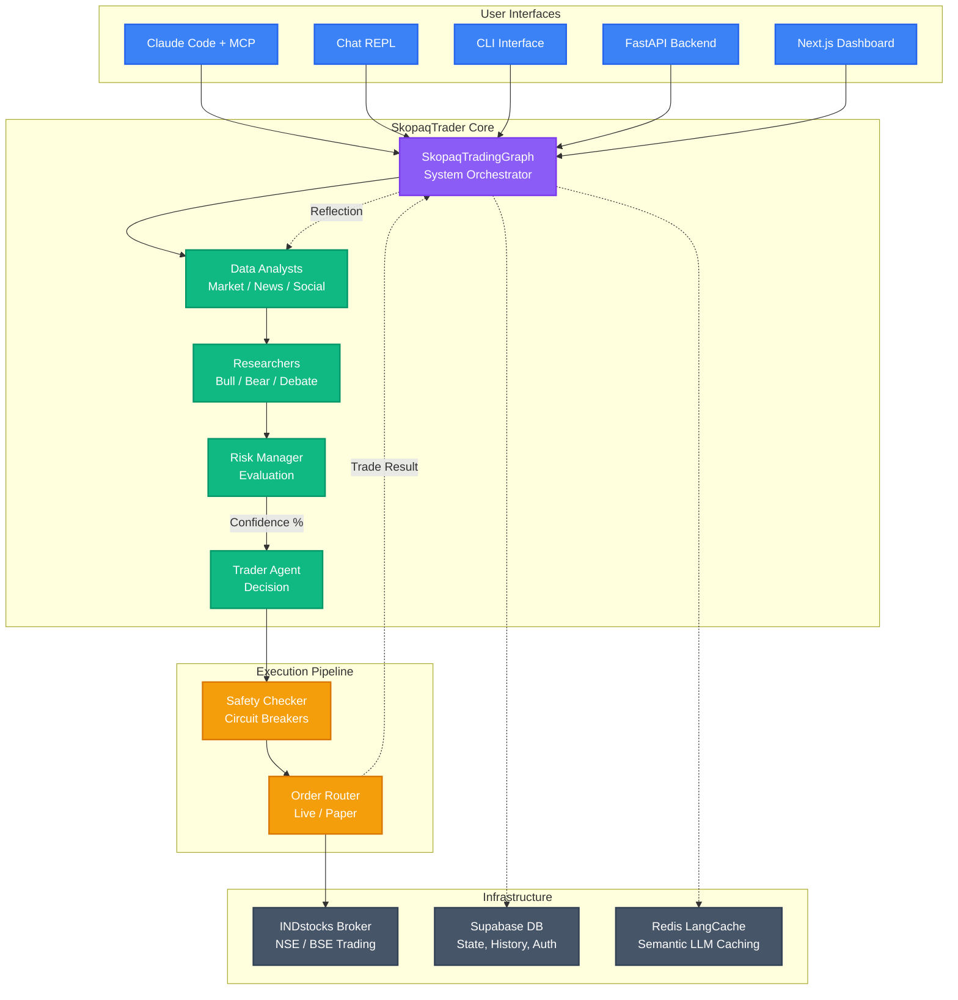
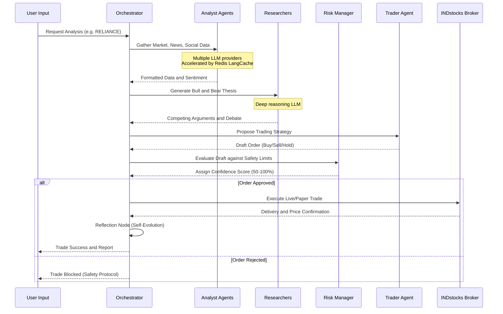
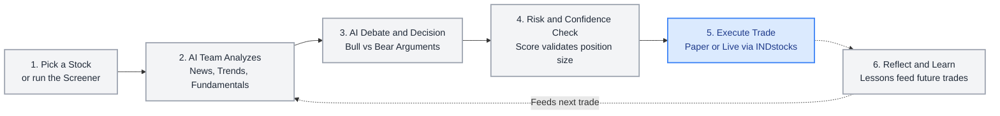
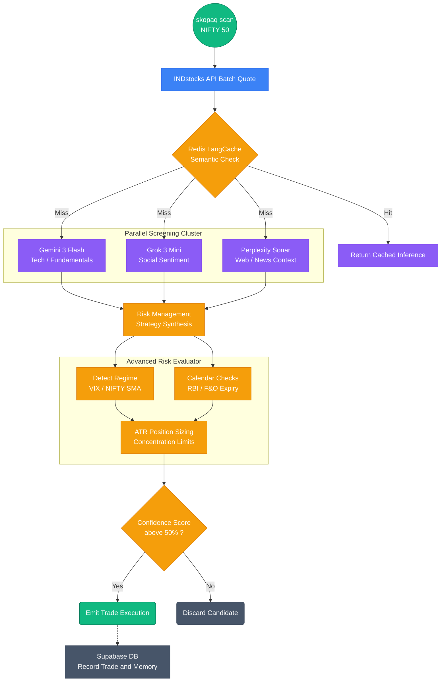

# SkopaqTrader

> **Note:** This is [williamscott701](https://github.com/williamscott701)'s fork of [samuelvinay91/skopaqtrader](https://github.com/samuelvinay91/skopaqtrader).

**An open-source AI algorithmic trading platform for Indian equities**

Built on [TradingAgents](https://github.com/TauricResearch/TradingAgents) (Apache 2.0) by TauricResearch

[License](LICENSE)
[Python](https://python.org)
[Built with LangGraph](https://langchain-ai.github.io/langgraph/)

> [!CAUTION]
> **IMPORTANT LEGAL DISCLAIMER**
>
> This software is provided **strictly for educational and research purposes only**. It is **NOT** financial advice, investment advice, or trading advice of any kind.
>
> - **No guarantees of profit.** Algorithmic trading involves substantial risk of financial loss. Past performance does not guarantee future results.
> - **You are solely responsible** for any trades executed using this software, whether in paper or live mode.
> - **The authors and contributors are not** registered investment advisors, broker-dealers, or financial planners under SEBI, SEC, or any regulatory body.
> - **Use at your own risk.** By using this software, you acknowledge that you understand the risks of automated trading and accept full responsibility for all outcomes.
>
> *If you need financial advice, consult a SEBI-registered investment advisor.*

---

## Overview

SkopaqTrader extends the [TradingAgents](https://github.com/TauricResearch/TradingAgents) multi-agent LLM framework with Indian equity market support, multi-model tiering, broker integration, and an experience-driven execution pipeline.

**Key capabilities:**

- **Claude Code Integration** — Native MCP server with 36 tools + custom slash commands (`/analyze`, `/quote`, `/scan`, `/portfolio`, `/trade`). Run the full 15-agent analysis pipeline using Claude's own reasoning at zero extra LLM cost.
- **Interactive AI Chat** — Claude Code-style REPL (`skopaq chat`) with streaming responses, tool panels, human-in-the-loop trade confirmation, and LangGraph checkpointing.
- **Ollama Local Fallback** — Run analyst roles on local models via Ollama/MLX for offline operation and zero API cost.
- **Post-Trade Reflection Loop** — Reflection node analyzes past trades and injects history into the analyst context, enabling the system to incorporate lessons from wins and losses over time.
- **Persistent Agent Memory** — BM25-indexed memory store backed by Supabase for long-term strategic recall across all agent roles.
- **Multi-agent analysis** — Analyst team (market, news, social, fundamentals), bull/bear researchers, risk manager, and trader agent collaborate via LangGraph.
- **Multi-model tiering** — Per-role LLM assignment across multiple providers for cost optimization and capability matching. See the [model tiering table](#multi-model-tiering) below for details.
- **Semantic LLM Caching** — Built-in Redis LangCache provides significant speedup (up to ~45x in our benchmarks) on repeated queries and reduces API costs, with automatic semantic invalidation on memory updates.
- **Advanced Risk Management** — Features ATR-based position sizing, India VIX/NIFTY SMA market regime detection, NSE event calendar handling (F&O expiry, RBI policy), and sector concentration limits.
- **Live Algo Trading** — Integrates with the INDstocks broker API for execution on Indian equities (NSE/BSE). Start in paper mode, graduate to live when ready.
- **Confidence-Scored Position Sizing** — The Risk Manager evaluates trades with strict confidence scores (50-100%). Position sizes are dynamically scaled based on this AI confidence level.
- **Parallel Scanner Engine** — 30-second multi-model screening cycle on the NIFTY 50 watchlist, wired directly to INDstocks batch quotes and 3 LLM screeners (Gemini, Grok, Perplexity) running concurrently.
- **Safety-First Execution** — Immutable position limits, persistent drawdown tracking, daily loss circuit breakers, and small-account exemptions.
- **Autonomous Trading Daemon** — Full session orchestrator: PRE_OPEN → SCANNING → ANALYZING → TRADING → MONITORING → CLOSING → REPORTING. Runs unattended on a cron schedule with graceful SIGTERM handling and tighter safety rules.
- **Three-Tier Position Monitor** — Hard stop-loss, AI sell analyst, and EOD safety net with optional trailing stops and configurable poll intervals.
- **Min Profit Gate** — Two-layer protection against brokerage-eating-profit: prompt guidance to the sell analyst LLM + hard override in the monitor that blocks sells when net profit (after estimated brokerage) is below threshold.
- **Crypto Support** — On-chain (Blockchair), DeFi/tokenomics (DeFiLlama/CoinGecko), and funding rate (Binance Futures) analysts activate when `asset_class=crypto`.
- **Blockchain Infrastructure** — Live Binance trading, WebSocket real-time feeds, gas oracles (ETH/Polygon/Arbitrum/Optimism), whale transaction alerts, and multi-exchange abstraction layer.

> **Reminder:** See the [full disclaimer](#important-legal-disclaimer) at the top. This is a research tool, not a trading recommendation system.

## 🏗️ Technical Architecture




*High-level overview of the SkopaqTrader architecture, connecting the user interfaces to the multi-agent AI team and the INDstocks execution engine.*

### 🤖 AI Agent Workflow

*Conceptual representation of the high-speed data flow between the AI Analyst agents, debate researchers, and the core routing system.*




*The step-by-step collaborative workflow of our AI agent team, from data gathering to safe execution.*

### 🚀 Usage Lifecycle (For Beginners)




*A simple mental model of how SkopaqTrader operates, making complex algorithmic trading easy to understand.*

### 🔍 Deep-Dive: Scanner Engine & Advanced Risk

*Conceptual UI of the SkopaqTrader scanner engine processing live NIFTY 50 metrics, sentiment scores, and confidence data.*

The real power of SkopaqTrader lies in its parallel scanner and dynamic risk management logic. When running `skopaq scan`, the system doesn't rely on just one LLM or simple heuristics. It queries multiple models simultaneously while injecting Indian market regime rules.




### Multi-Model Tiering


| Agent Role                       | Primary Model                                 | Fallback       | Local Fallback       |
| -------------------------------- | --------------------------------------------- | -------------- | -------------------- |
| Market / Fundamentals Analyst    | Gemini 3 Flash                                | —              | Ollama (auto)        |
| Social Analyst                   | Grok 3 Mini (via OpenRouter)                  | Gemini 3 Flash | Ollama (auto)        |
| News Analyst                     | Gemini 3 Flash                                | —              | Ollama (auto)        |
| Research Manager                 | Claude Opus 4.6                               | Gemini 3 Flash | — (quality critical) |
| Risk Manager                     | Claude Opus 4.6                               | Gemini 3 Flash | — (quality critical) |
| Chat Brain                       | Claude Opus 4.6                               | Gemini 3 Flash | Ollama (auto)        |
| Bull / Bear / Debate Researchers | Gemini 3 Flash                                | —              | Ollama (auto)        |
| Trader                           | Gemini 3 Flash                                | —              | Ollama (auto)        |
| Sell Analyst                     | Gemini 3 Flash                                | —              | Ollama (auto)        |
| Scanner Screeners                | Gemini 3 Flash, Grok 3 Mini, Perplexity Sonar | (concurrent)   | —                    |


> **Note:** Perplexity Sonar is used only in the scanner (plain prompts). It does not support tool calling, so it cannot serve as an analyst in the LangGraph agent pipeline.
>
> **Ollama fallback** activates only when `SKOPAQ_OLLAMA_ENABLED=true` and Ollama is running locally. Judge roles (Research Manager, Risk Manager) never fall back to local models.

### Blockchain Infrastructure

SkopaqTrader includes comprehensive blockchain infrastructure for crypto trading:


| Feature             | Module                          | Description                                                     |
| ------------------- | ------------------------------- | --------------------------------------------------------------- |
| **Live Trading**    | `skopaq/broker/binance_auth.py` | Authenticated Binance API for spot trading with API keys        |
| **Real-Time Feeds** | `skopaq/broker/binance_ws.py`   | WebSocket streams for ticker, trades, order book, klines        |
| **Gas Oracle**      | `skopaq/blockchain/gas.py`      | ETH, Polygon, Arbitrum, Optimism gas prices + tx cost estimates |
| **Whale Alerts**    | `skopaq/blockchain/whales.py`   | Large transaction monitoring for BTC, ETH, SOL                  |
| **Multi-Exchange**  | `skopaq/broker/exchange.py`     | Unified abstraction layer (Binance, Coinbase, Kraken)           |


```python
# Live Binance trading
from skopaq.broker import BinanceAuthClient

async with BinanceAuthClient(api_key="...", api_secret="...") as client:
    await client.place_order("BTCUSDT", "BUY", 0.001, 50000.0)

# Real-time price via WebSocket
from skopaq.broker import BinanceWS

ws = BinanceWS()
async for ticker in ws.ticker_stream("BTCUSDT"):
    print(f"BTC: ${ticker.price}")

# Gas oracle
from skopaq.blockchain import get_gas_price, get_gas_estimate

gas = await get_gas_price("ETH")
estimate = await get_gas_estimate("ETH", "USDT transfer")

# Whale alerts
from skopaq.blockchain import check_whale_alerts

alerts = await check_whale_alerts("ETH", min_value_usd=100000)
```

## Installation

### Prerequisites

- Python 3.11+
- API keys for at least one LLM provider (Google Gemini recommended as minimum)

### Setup

```bash
git clone https://github.com/williamscott701/skopaqtrader.git
cd skopaqtrader

# Create virtual environment
python -m venv .venv
source .venv/bin/activate  # macOS/Linux

# Install dependencies
pip install -e ".[dev]"

# Configure environment
cp .env.example .env
# Edit .env with your API keys
```

### Required API Keys

At minimum, set `GOOGLE_API_KEY` for Gemini 3 Flash (used as default/fallback for all roles).

For full multi-model tiering:

```bash
GOOGLE_API_KEY=...          # Gemini 3 Flash (all analyst roles)
ANTHROPIC_API_KEY=...       # Claude Opus 4.6 (research/risk manager)
OPENROUTER_API_KEY=...      # Grok + Perplexity Sonar (social + news)
```

See `[.env.example](.env.example)` for all configuration options.

## Usage

> [!WARNING]
> All trading commands (live or paper) are **at your own risk**. The AI agents may produce incorrect signals. Always verify positions manually and never risk capital you cannot afford to lose.

### CLI

```bash
# System health check
skopaq status

# Analyze a stock (no execution)
skopaq analyze RELIANCE
skopaq analyze TATAMOTORS --date 2026-02-28

# Analyze + execute (paper mode by default)
skopaq trade RELIANCE

# Run scanner cycle
skopaq scan --max-candidates 5

# Autonomous daemon (full session: scan → trade → monitor → close)
# WARNING: The daemon trades autonomously. Use paper mode until you are confident.
skopaq daemon --once --paper           # Single paper session, run immediately
skopaq daemon --dry-run                # Scanner only, print candidates, exit
skopaq daemon --once --max-trades 1    # Live mode, 1 trade max (requires confirmation)

# Position monitor (attach to existing open positions)
skopaq monitor                         # Monitor all open positions until EOD

# Start API server
skopaq serve --port 8000

# Token management (INDstocks broker)
skopaq token set <your-token>
skopaq token status
```

### Python API

```python
from skopaq.config import SkopaqConfig
from skopaq.graph.skopaq_graph import SkopaqTradingGraph

config = SkopaqConfig()
graph = SkopaqTradingGraph(config)

# Analysis only
result = await graph.analyze("RELIANCE", "2026-03-01")
print(result.signal)

# Analysis + execution
result = await graph.analyze_and_execute("RELIANCE", "2026-03-01")
print(result.execution)
```

### Interactive Chat (Claude Code-style REPL)

```bash
# Start the interactive AI trading assistant
skopaq chat                    # Paper mode (default)
skopaq chat --live             # Live mode (with confirmation)

# Inside the REPL:
> what should I trade today?   # Natural language → AI reasons + calls tools
> /quote RELIANCE              # Instant quote (no LLM call)
> /scan 10                     # Top 10 market candidates
> /portfolio                   # Show positions + P&L
> /analyze TCS                 # Full multi-agent analysis
> /mode live                   # Switch to live mode (confirmation required)
```

## Claude Code Integration (MCP + Skills)

SkopaqTrader integrates natively with [Claude Code](https://claude.ai/code) as an MCP server + custom slash commands. This turns Claude Code into a **full-featured trading terminal** — with Claude's own reasoning powering the multi-agent analysis pipeline at zero extra LLM cost.

### Quick Setup (3 steps)

**Step 1: Install SkopaqTrader**

```bash
git clone https://github.com/williamscott701/skopaqtrader.git
cd skopaqtrader
pip install -e .
cp .env.example .env   # Add your API keys
```

**Step 2: Register MCP Server**

Add to your `~/.claude.json` (or run `/mcp add` in Claude Code):

```json
{
  "mcpServers": {
    "skopaq": {
      "command": "python3",
      "args": ["-m", "skopaq.mcp_server"]
    }
  }
}
```

**Step 3: Restart Claude Code**

Open Claude Code in the `skopaqtrader` directory. The MCP server starts automatically. You'll see 36 trading tools available.

### Custom Slash Commands (Skills)

These are pre-built in `.claude/skills/` and available immediately:


| Command           | What it does                                                                                                                             |
| ----------------- | ---------------------------------------------------------------------------------------------------------------------------------------- |
| `/quote RELIANCE` | Real-time stock quote via MCP                                                                                                            |
| `/analyze TCS`    | Full 15-agent analysis pipeline — Claude reasons through 4 analysts, bull/bear debate, risk debate, and final decision using its own LLM |
| `/scan`           | Market scanner — finds top trading candidates                                                                                            |
| `/portfolio`      | Shows positions, holdings, funds, P&L                                                                                                    |
| `/trade INFY`     | Analysis + safety check + paper execution (with confirmation)                                                                            |


### MCP Tools (36 available)

All tools are callable by Claude Code natively. Read-only tools are auto-approved via `.claude/settings.json`:


| Category          | Tools                                                                                                                  |
| ----------------- | ---------------------------------------------------------------------------------------------------------------------- |
| **Market Data**   | `get_quote`, `get_historical`                                                                                          |
| **Portfolio**     | `get_positions`, `get_holdings`, `get_funds`, `get_orders`                                                             |
| **Analysis**      | `analyze_stock`, `scan_market`, `check_safety`                                                                         |
| **Execution**     | `place_order`, `place_gtt_order`, `list_gtt_orders`, `setup_swing_trade`, `place_amo_order`, `place_bracket`, `place_cover`, `place_basket` (paper/live, safety-checked) |
| **Options**       | `get_option_chain`, `suggest_option_trade`, `buy_option_contract`                                                      |
| **Futures & Funds** | `trade_future`, `invest_mutual_fund`, `list_mutual_funds`                                                            |
| **Data Pipeline** | `gather_market_data`, `gather_news_data`, `gather_fundamentals_data`, `gather_social_data`, `gather_all_analysis_data` |
| **Memory**        | `recall_agent_memories`, `save_trade_reflection`                                                                       |
| **Learning / Backtesting** | `backtest_strategy`, `run_monte_carlo_test`, `get_learning_insights`, `get_symbol_stats`, `evolve_strategy`         |
| **System**        | `system_status`                                                                                                        |


### Dual-Mode Architecture

SkopaqTrader has two execution paths for the same multi-agent pipeline:

```
┌─────────────────────────────────────────────────────────┐
│ Claude Code Mode (zero LLM cost)                        │
│                                                         │
│  /analyze RELIANCE                                      │
│    → gather_all_analysis_data (MCP) → raw data          │
│    → Claude reasons as 4 analysts                       │
│    → Claude runs bull/bear debate                       │
│    → Claude acts as research manager (judge)             │
│    → Claude runs 3-way risk debate                      │
│    → Claude acts as risk manager → BUY/SELL/HOLD + %    │
│    → check_safety (MCP) → validated                     │
│                                                         │
│  Uses: Claude's own LLM for all reasoning               │
│  Cost: $0 additional (Claude Code subscription only)    │
│  Time: ~30s data fetch + Claude's reasoning             │
└─────────────────────────────────────────────────────────┘

┌─────────────────────────────────────────────────────────┐
│ API Mode (separate LLM calls)                           │
│                                                         │
│  skopaq analyze RELIANCE                                │
│    → SkopaqTradingGraph.analyze()                       │
│    → 4 analyst LLM calls (Gemini Flash)                 │
│    → Bull/Bear researcher calls (Gemini Flash)          │
│    → Research Manager call (Claude Opus API)            │
│    → Trader call (Gemini Flash)                         │
│    → 3 risk debater calls (Gemini Flash)                │
│    → Risk Manager call (Claude Opus API)                │
│                                                         │
│  Uses: Separate API calls to Gemini/Claude/Grok         │
│  Cost: ~$0.20-0.50 per analysis                         │
│  Time: 2-5 minutes                                      │
└─────────────────────────────────────────────────────────┘
```

Both modes use the **same data sources** and the **same agent prompts** — the only difference is who does the reasoning.

### Ollama Local Model Fallback

For offline operation or zero-cost inference, SkopaqTrader supports local models via [Ollama](https://ollama.ai):

```bash
# Install Ollama (macOS)
brew install ollama
ollama pull mistral    # or any model

# Enable in SkopaqTrader
export SKOPAQ_OLLAMA_ENABLED=true
skopaq chat            # Uses local model as fallback when cloud APIs fail
```

Local models serve as the **last fallback** in the provider chain. Judge roles (research_manager, risk_manager) skip local models to preserve reasoning quality.

### OpenClaw Integration

SkopaqTrader also integrates with [OpenClaw](https://openclaw.ai) for multi-channel access via WhatsApp, Telegram, and Slack. See `openclaw.json` for configuration.

### Upstream TradingAgents (Direct)

The vendored upstream is fully functional:

```python
from tradingagents.graph.trading_graph import TradingAgentsGraph
from tradingagents.default_config import DEFAULT_CONFIG

ta = TradingAgentsGraph(debug=True, config=DEFAULT_CONFIG.copy())
_, decision = ta.propagate("NVDA", "2026-01-15")
print(decision)
```

## Project Structure

```
skopaqtrader/
├── tradingagents/              # Vendored upstream (TradingAgents v0.2.0)
│   ├── agents/                 # Analyst, researcher, trader, risk agents
│   │   ├── analysts/           # Market, news, social, fundamentals + crypto analysts
│   │   ├── researchers/        # Bull/bear researchers
│   │   ├── managers/           # Research + risk managers
│   │   ├── risk_mgmt/          # Aggressive/conservative/neutral debators
│   │   └── trader/             # Final trade decision agent
│   ├── graph/                  # LangGraph orchestration + reflection
│   ├── dataflows/              # Data vendors (yfinance, INDstocks, crypto APIs)
│   └── llm_clients/            # LLM factory (OpenAI, Google, Anthropic, etc.)
│
├── skopaq/                     # SkopaqTrader extensions
│   ├── agents/                 # Sell analyst (AI exit decisions)
│   ├── api/                    # FastAPI backend server
│   ├── blockchain/             # Gas oracle, whale alerts
│   ├── broker/                 # INDstocks REST/WebSocket + Binance + paper engine
│   ├── chat/                   # Interactive chatbot (REPL, tools, agent, bridge)
│   ├── cli/                    # Typer CLI (analyze, trade, scan, daemon, monitor, chat)
│   ├── db/                     # Supabase client + repositories
│   ├── execution/              # Executor, safety checker, order router, daemon, monitor
│   ├── graph/                  # SkopaqTradingGraph (upstream wrapper)
│   ├── llm/                    # Multi-model tiering, env bridge, semantic cache, Ollama
│   ├── memory/                 # BM25-indexed agent memory + trade reflection loop
│   ├── risk/                   # ATR sizing, regime detection, drawdown, calendar
│   ├── scanner/                # Multi-model market scanner engine
│   ├── mcp_server.py           # MCP server (36 tools for Claude Code integration)
│   ├── config.py               # Pydantic Settings (env_prefix="SKOPAQ_")
│   └── constants.py            # Immutable safety rules + daemon variants
│
├── frontend/                   # Next.js dashboard (Vercel)
├── supabase/                   # Database migrations
├── docker/                     # Dockerfile for Railway
├── .claude/                    # Claude Code integration
│   ├── skills/                 # Custom slash commands (/quote, /analyze, /scan, etc.)
│   ├── settings.json           # Auto-allowed MCP tools
│   └── .mcp.json               # MCP server registration
│
├── openclaw/                   # OpenClaw skill wrappers (WhatsApp/Telegram/Slack)
├── tests/                      # 540 unit + integration tests
│   ├── unit/                   # Fast tests (no API keys needed)
│   └── integration/            # Real API calls (requires .env)
│
├── CLAUDE.md                   # AI agent project context
├── UPSTREAM_CHANGES.md         # All modifications to vendored code (34 changes)
├── CONTRIBUTING.md             # Contribution guidelines
├── pyproject.toml              # Python project config
├── railway.toml                # Railway API server config
├── railway-daemon.toml         # Railway daemon cron config
└── LICENSE                     # Apache 2.0
```

## Security

- **No secrets in the repository.** All API keys, tokens, and credentials are loaded from environment variables via `.env` (gitignored). See `[.env.example](.env.example)` for the full list of configurable keys.
- **INDstocks tokens** are stored locally in `~/.skopaq/token.json` (gitignored) and validated on every daemon session start.
- **Immutable safety rules** in `skopaq/constants.py` enforce position limits, order value caps, and rate limits that cannot be overridden at runtime.
- **Daemon safety variants** apply tighter limits for unattended operation (fewer positions, lower order caps, slower pace).
- **Live trading double-gate** — the `trade` and `daemon` CLI commands require an explicit confirmation prompt before executing real orders.

If you discover a security issue, please report it privately rather than opening a public issue.

## Testing

The test suite contains **540 unit tests** (no API keys needed) plus integration tests for real broker/LLM calls.

```bash
# Unit tests — fast, no external dependencies
python -m pytest tests/unit/ -v

# Integration tests (requires .env with real API keys)
python -m pytest tests/integration/ -v -m integration

# All tests with coverage
python -m pytest --cov=skopaq --cov=tradingagents -v
```

## Docker

The fastest way to get started. One image, all services.

```bash
# Pull and run (when published to Docker Hub)
docker pull skopaqtrader/skopaqtrader:latest

# Or build locally
git clone https://github.com/williamscott701/skopaqtrader.git
cd skopaqtrader
docker build -t skopaqtrader/skopaqtrader .
```

### Quick Start with Docker

```bash
# 1. Configure
cp .env.example .env
# Edit .env with your API keys (at minimum SKOPAQ_GOOGLE_API_KEY)

# 2. Run any service
docker run -it --env-file .env skopaqtrader/skopaqtrader chat        # AI chatbot
docker run -d --env-file .env skopaqtrader/skopaqtrader telegram     # Telegram bot
docker run -d --env-file .env -p 8000:8000 skopaqtrader/skopaqtrader api  # FastAPI
docker run --rm --env-file .env skopaqtrader/skopaqtrader scan       # Market scan
docker run --rm --env-file .env skopaqtrader/skopaqtrader status     # Health check
```

### Docker Compose (recommended)

```bash
cp .env.example .env   # Add your API keys
docker compose up -d   # Starts API + Telegram bot
```

### Available Services


| Service       | Command     | Description                  |
| ------------- | ----------- | ---------------------------- |
| `api`         | Default     | FastAPI backend (port 8000)  |
| `chat`        | Interactive | Claude Code-style AI chatbot |
| `telegram`    | Background  | Telegram bot (@Skopaq_bot)   |
| `mcp`         | stdio       | MCP server for Claude Code   |
| `daemon`      | One-shot    | Paper trading session        |
| `daemon-live` | One-shot    | LIVE trading session         |
| `monitor`     | Background  | Position monitor             |
| `scan`        | One-shot    | Market scanner               |
| `status`      | One-shot    | System health check          |
| `shell`       | Interactive | Bash shell for debugging     |


## Cloud Deployment

> [!WARNING]
> Deploying autonomous trading to a cloud server means orders will execute **without human supervision**. Start with paper mode, set conservative limits, and monitor logs daily. You are fully responsible for any trades placed by the daemon.


| Service               | Config                                       | Purpose                                       |
| --------------------- | -------------------------------------------- | --------------------------------------------- |
| **Railway** (API)     | `[railway.toml](railway.toml)`               | FastAPI backend server                        |
| **Railway** (Daemon)  | `[railway-daemon.toml](railway-daemon.toml)` | Autonomous trading cron (09:10 IST, weekdays) |
| **Vercel**            | `frontend/`                                  | Next.js dashboard                             |
| **Supabase**          | `supabase/`                                  | PostgreSQL + Auth + agent memory              |
| **Upstash**           | —                                            | Serverless Redis (semantic LLM cache)         |
| **Cloudflare Tunnel** | —                                            | Static IP for INDstocks API whitelist         |


## Upstream Modifications

All 34 changes to the vendored `tradingagents/` directory are documented in `[UPSTREAM_CHANGES.md](UPSTREAM_CHANGES.md)`.

**Modification philosophy:** Minimal, surgical changes. The upstream graph runs as a black box via `propagate()`. Skopaq wraps it with execution, safety, and multi-model tiering.

**Categories of modifications:**

- **Multi-model tiering** — `llm_map` support in `graph/setup.py` and `trading_graph.py`
- **INDstocks data vendor** — New `dataflows/indstocks.py` + registration in `interface.py`
- **Parallel analyst execution** — State reducers in `agent_states.py`, fan-out wiring in `setup.py`
- **Crypto analyst agents** — 7 new files (on-chain, DeFi, funding) + 9 modified debate consumers
- **Confidence scoring** — Risk manager prompt addition for structured confidence output
- **Bugfixes** — yfinance symbol suffix handling, comma-separated indicator splitting, `.NS`/`.BO` stripping

**Diff command:** `git diff upstream-v0.2.0..HEAD -- tradingagents/`

## Contributing

We welcome contributions! Please see [CONTRIBUTING.md](CONTRIBUTING.md) for guidelines.

**Quick start:**

1. Fork the repository
2. Create a feature branch (`git checkout -b feature/my-feature`)
3. Write tests for your changes
4. Ensure all tests pass (`python -m pytest tests/unit/ -v`)
5. Submit a pull request

### Contributing New Skills

Add custom Claude Code slash commands in `.claude/skills/<name>/SKILL.md`:

```markdown
---
name: my-skill
description: What it does
argument-hint: <SYMBOL>
user-invocable: true
allowed-tools: mcp__skopaq__get_quote mcp__skopaq__get_historical
---

# My Skill

Instructions for Claude Code when this skill is invoked.
Use MCP tools (mcp__skopaq__*) for data — do NOT write Python code to call broker APIs directly.
```

### Contributing New MCP Tools

Add tools to `skopaq/mcp_server.py` using the `@mcp.tool()` decorator:

```python
@mcp.tool()
async def my_tool(symbol: str) -> str:
    """Description of what this tool does."""
    # Call existing infrastructure
    return json.dumps({"result": "..."})
```

Then add the tool name to `.claude/settings.json` permissions for auto-approval.

## Citation

SkopaqTrader is built on the TradingAgents framework. Please reference the original work:

```bibtex
@misc{xiao2025tradingagentsmultiagentsllmfinancial,
      title={TradingAgents: Multi-Agents LLM Financial Trading Framework},
      author={Yijia Xiao and Edward Sun and Di Luo and Wei Wang},
      year={2025},
      eprint={2412.20138},
      archivePrefix={arXiv},
      primaryClass={q-fin.TR},
      url={https://arxiv.org/abs/2412.20138},
}
```

## Trademarks

All product names, logos, and brands mentioned in this project are property of their respective owners. Their use here does not imply endorsement, sponsorship, or affiliation.

- **Gemini** is a trademark of Google LLC.
- **Claude** is a trademark of Anthropic, PBC.
- **Grok** is a trademark of xAI Corp.
- **Perplexity** is a trademark of Perplexity AI, Inc.
- **LangGraph** and **LangChain** are trademarks of LangChain, Inc.
- **NIFTY** and **NIFTY 50** are registered trademarks of NSE Indices Limited.
- **NSE** is a trademark of National Stock Exchange of India Limited.
- **BSE** is a trademark of BSE Limited.
- **INDstocks** is a trademark of its respective owner.
- **Supabase**, **Vercel**, **Railway**, **Upstash**, **Cloudflare**, and **OpenRouter** are trademarks of their respective companies.

All trademarks are used here solely for identification and interoperability purposes.

## License

This project is licensed under the [Apache License 2.0](LICENSE).

SkopaqTrader is a derivative work of [TradingAgents](https://github.com/TauricResearch/TradingAgents) by [TauricResearch](https://tauric.ai/), originally released under the Apache License 2.0. All original copyright and attribution notices are retained per the license terms.

---

**Disclaimer:** This software is for educational and research purposes only. It does not constitute financial, investment, or trading advice. Trading in financial markets carries substantial risk. The authors accept no liability for losses incurred through the use of this software. See the [full disclaimer](#important-legal-disclaimer) at the top of this page.